<p align="center">
  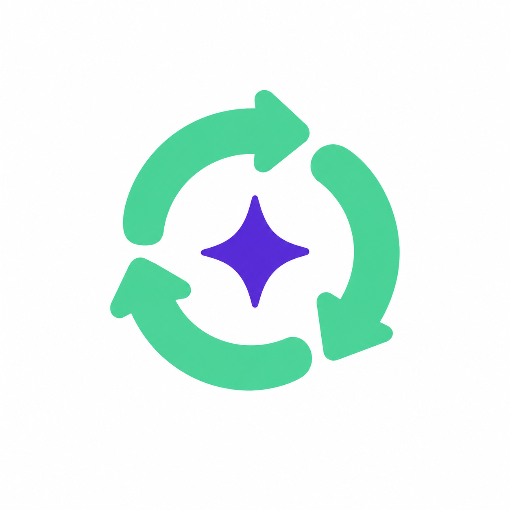
</p>

<h1 align="center">Sirkular</h1>

<p align="center">
  <b>Circular business operations for small food and craft businesses (UMKM).</b><br/>
  Turn leftover ingredients into new products, sell them everywhere from one place, and see the impact.
</p>

<p align="center">
  
  
  
  
  
</p>

---

## Demo

[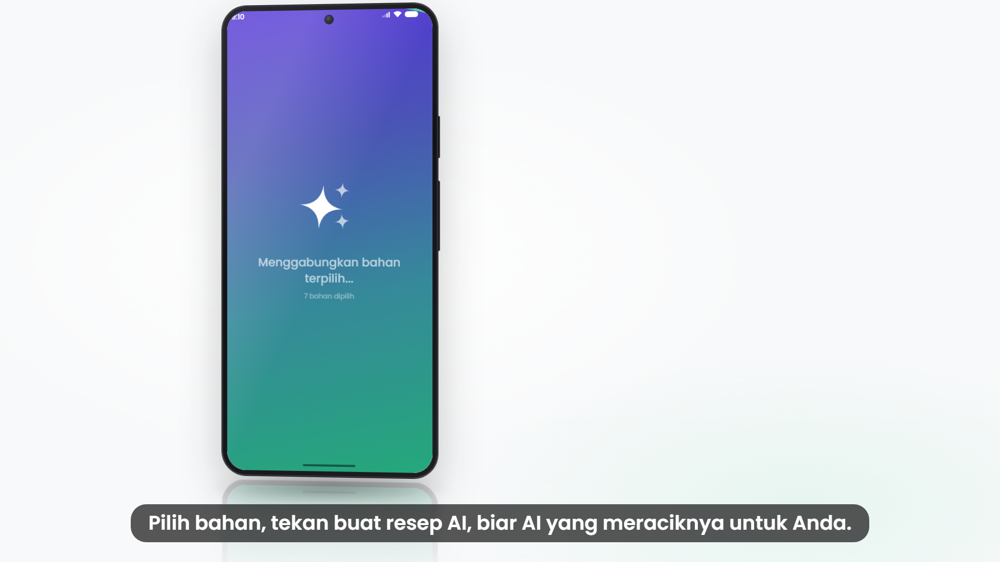](docs/media/sirkular-demo.mp4)

> Click the image to watch the full demo video (`docs/media/sirkular-demo.mp4`).

## What it does

Sirkular helps a small business see what it is wasting and do something about it.

- **Dashboard** with revenue for the last 30 days, orders per platform, deadstock saved, stock health, and live orders. It has a web-style layout for wide screens and a phone layout for everything else.
- **Insights** shown as full-screen stories, such as expiring stock, a recommended discount, or a platform trend.
- **Inventory** with a product grid: tap a card to restock, tick checkboxes to select several products, and see best sellers in strong mint and slow movers faded.
- **Add product from a photo.** The camera fills in name, category, stock, and estimated price (Gemini).
- **AI R&D (mix and match).** Select leftover ingredients and get three product ideas with cost (HPP), selling price, profit, difficulty, ingredients, and steps. Save an idea to inventory and make it sellable.
- **Multi-platform publishing.** Select products and publish them to Tokopedia, Shopee, and TikTok Shop in one step.
- **Platform analytics** for Tokopedia and Shopee: conversion, ad keywords, buyer retention, busiest hours, and store settings (auto-reply, vouchers, daily ad budget).
- **Customizable dashboard.** Show or hide each section.

Every number on the screens comes from a local SQLite database. The app seeds two demo accounts on first launch (see [Demo accounts](#demo-accounts)).

## Screenshots

<table>
  <tr>
    <td align="center">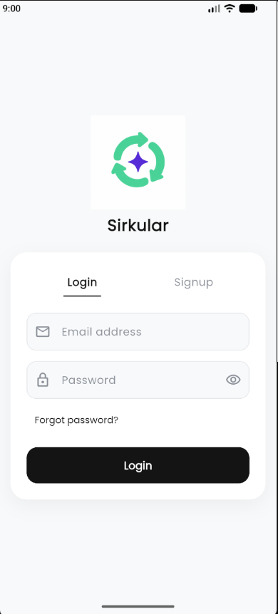<br/><sub>Login and signup</sub></td>
    <td align="center">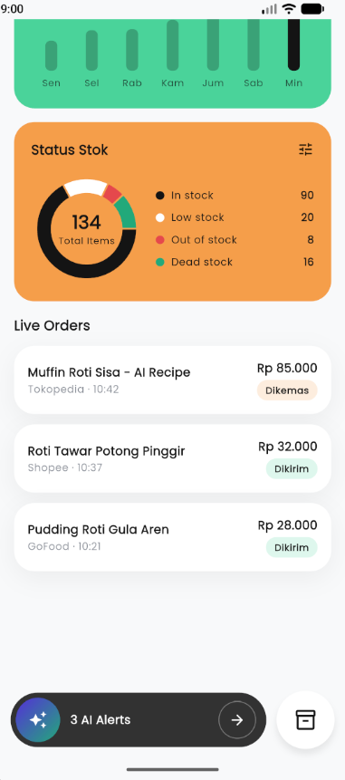<br/><sub>Dashboard</sub></td>
    <td align="center">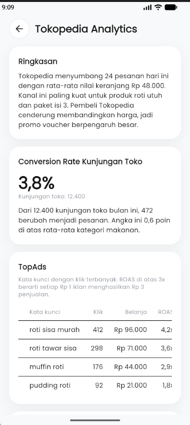<br/><sub>Stock and orders</sub></td>
    <td align="center">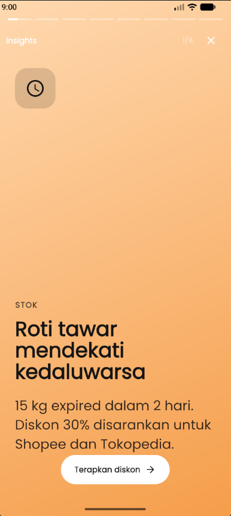<br/><sub>Insight stories</sub></td>
  </tr>
  <tr>
    <td align="center">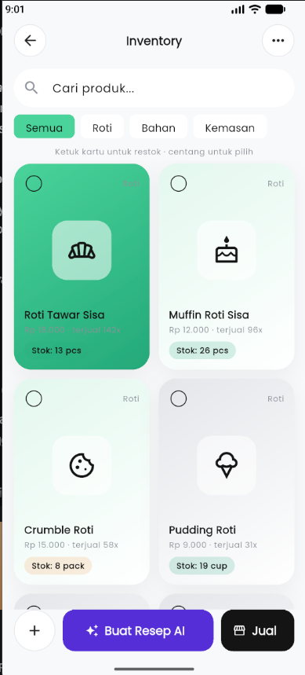<br/><sub>Inventory</sub></td>
    <td align="center">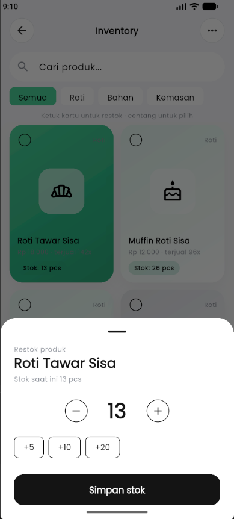<br/><sub>Quick restock</sub></td>
    <td align="center">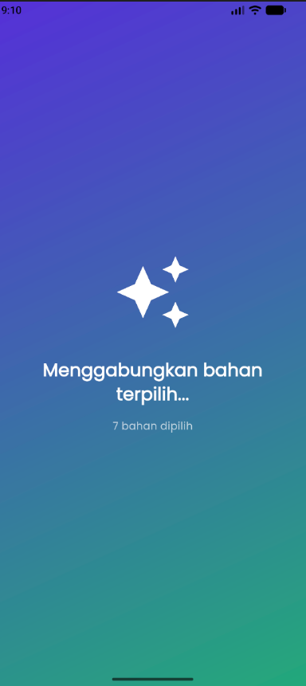<br/><sub>AI R&D loading</sub></td>
    <td align="center">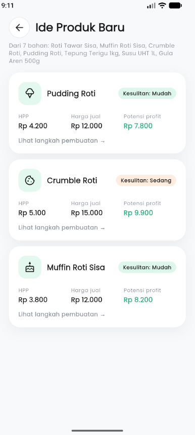<br/><sub>Product ideas</sub></td>
  </tr>
  <tr>
    <td align="center">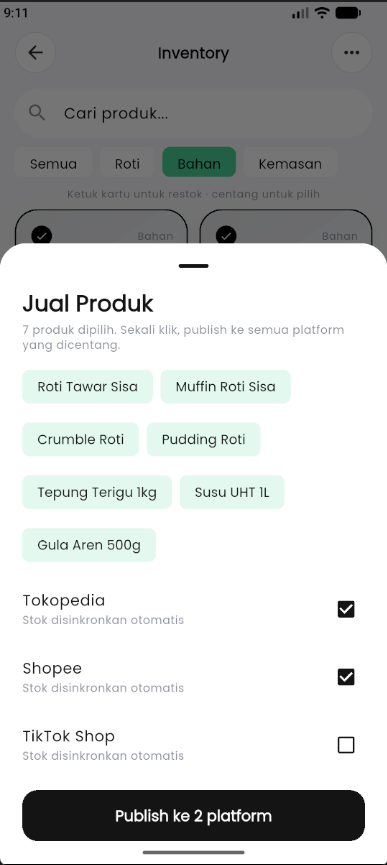<br/><sub>Multi-platform publish</sub></td>
    <td align="center">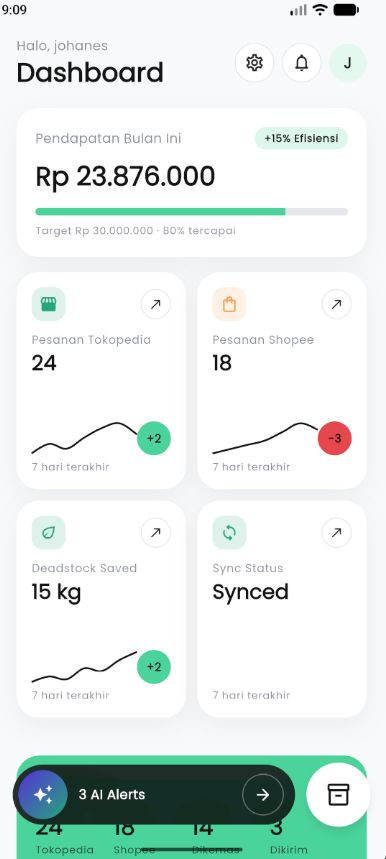<br/><sub>Platform analytics</sub></td>
  </tr>
</table>

## Tech stack

| Area | Technology |
|---|---|
| App | Flutter (Dart), Material 3 |
| Local data | SQLite via `sqflite`, versioned migrations |
| Auth | Local accounts, salted SHA-256 password hashing |
| Charts | `fl_chart` |
| Camera | `image_picker` |
| AI | Google Gemini REST API (photo analysis and recipe ideas) |
| Icons | 85 product icons, generated with GPT (see [`docs/icon-pack.md`](docs/icon-pack.md)) |

## Getting started

### 1. Requirements

- **Flutter 3.27 or newer** (Dart 3.6 or newer). Check with `flutter --version`.
- **Android Studio** with the Android SDK, or a connected Android phone with USB debugging on.
- **Git**.

To check your setup, run `flutter doctor`.

### 2. Clone and install

```bash
git clone https://github.com/linearthrone22/Sirkular.git
cd Sirkular
flutter pub get
```

### 3. Run the app

```bash
flutter run
```

Choose your device when prompted. The first build takes a few minutes while Gradle downloads.

To enable real AI (photo analysis and recipe ideas), pass a Gemini API key at build time. **Never commit the key.**

```bash
flutter run --dart-define=GEMINI_API_KEY=your_key_here
```

Without a key, the app uses built-in sample results, so everything else still works.

Optional: pick another Gemini model with `--dart-define=GEMINI_MODEL=model-name`.

### 4. Check the code

```bash
flutter analyze   # should report: No issues found
flutter test      # all tests should pass
flutter build apk --debug   # builds the Android app
```

### Demo accounts

On first launch, the app creates two demo accounts with sample data:

| Email | Password |
|---|---|
| `johanes@gmail.com` | `sirkular123` |
| `jovan@gmail.com` | `sirkular123` |

These are for local demos only. If an account already exists, its password is kept.

## Project structure

```
lib/
├── core/
│   ├── ai/            Gemini REST client
│   ├── database/      SQLite setup, migrations, demo data seeding
│   ├── format/        Rupiah, date, and time formatting
│   └── theme/         Colors and theme (monochrome base, mint and purple accents)
├── features/
│   ├── auth/          Login, signup, local accounts
│   ├── dashboard/     Dashboard (web and mobile), insights, platform analytics
│   └── inventory/     Products, restock, AI R&D, publishing, product icons
└── main.dart
assets/
├── icons/products/    85 product icon PNGs
└── images/            Logo
docs/                  Icon pack brief, screenshots, demo video
test/                  Unit and widget tests (in-memory database)
```

Each feature follows the same pattern: `data/` holds repositories and models, and `presentation/` holds screens and widgets.

## Database

The schema lives in `lib/core/database/schema.dart` as numbered migrations.

- **Never edit a migration that has shipped.** Add a new one with the next version number.
- Money is stored as whole rupiah (`INTEGER`). Timestamps are ISO-8601 text.
- Foreign keys are on. Deleting a user removes their data.

## Contributing

We welcome contributions, from bug reports to new features.

1. **Find or open an issue** so we can agree on the change before you start.
2. **Fork the repository** and clone your fork.
3. **Create a branch** named for the change, for example `feature/restock-history` or `fix/login-error`.
4. **Make your change.** Follow the structure above:
   - Keep UI in `presentation/`, data access in `data/`, and shared helpers in `core/`.
   - Use the colors and text styles from `core/theme/`. Purple is only for AI actions.
   - Put new product types in `lib/features/inventory/data/product_icons.dart` and the brief in `docs/icon-pack.md`.
5. **Test it.** Run `flutter analyze` and `flutter test`. Add a test for any new behavior, especially database changes.
6. **Commit** with a short, clear message in the present tense, for example `Add restock history to inventory`.
7. **Open a pull request** against `main`. Describe what changed, why, and how you tested it. Add screenshots for UI changes.

### Rules for contributors

- Never commit API keys, passwords, or local config (`local.properties`, `.env`).
- Don't edit an old migration. Add a new one.
- Keep `flutter analyze` clean.
- Keep the demo data in `lib/core/database/dummy_seed.dart` as the single source of demo content.

## Status and roadmap

This is a **hackathon prototype**. Some parts are real and some are simulated.

| Area | Status |
|---|---|
| Login, signup, local database, migrations | Working |
| Dashboard, insights, platform analytics | Working, reads from SQLite |
| Inventory, restock, multi-select, stock log | Working |
| Photo analysis and recipe ideas | Real with a Gemini key, sample data without one |
| Multi-platform publishing | Simulated: saves listings, does not upload to platforms yet |
| Notifications, forgot password, insight actions | Not built yet |
| Web (browser) | Not supported yet: the local database runs on Android and iOS only |
| Platform integrations (Tokopedia, Shopee, TikTok Shop APIs) | Planned |

## License

No license has been chosen yet. Until one is added, all rights are reserved by the authors. Please ask before reusing the code.

---

<p align="center">Made for Indonesian UMKM. Keep leftovers in use. 🌱</p>
